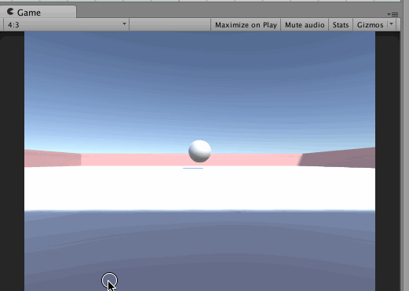
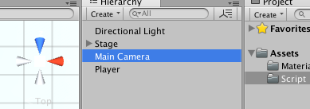
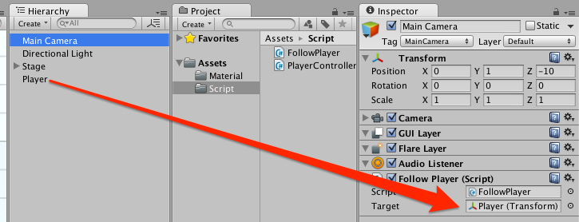
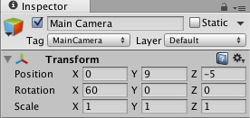
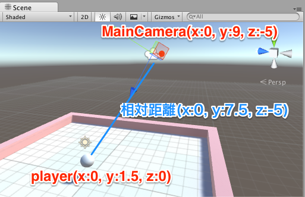

#3.カメラを動かす

今回はカメラを動かす方法について紹介します。

最も容易なカメラを動かす方法は、カメラをPlayerの子オブジェクトに設定することです。

Unityのオブジェクトは親オブジェクトとの相対座標で保持しているため、Playerの子にMainCameraを配置すれば、Playerが動作した際にカメラも追随する事になります。早速やってみましょう。

1.  HierarchyのMainCameraを選択
2.  同じくHIerarchyのPlayerへドラッグ＆ドロップ

ゲームを再生せずPlayerオブジェクトを動かしてみましょう。カメラはプレイヤーを追随して移動しています。


ではゲームを再生してみてください。世界がグルングルン回っています。


これはPlayer自体が転がって移動しているため、親子関係にあるカメラも転がっています。
これを解決する選択肢は2つ、「Playerが転がらないように移動」するか、「プレイヤーを追跡するコンポーネントを作るか」です。今回は後者を選択肢ます。

その前にMain CameraをPlayerオブジェクトから外しておきましょう。



##プレイヤーを追跡するコンポーネントの作成

プレイヤーを追跡するコンポーネントを作成します。
今回作るコンポーネントの機能は以下のとおりです。

1.  Playerの位置を取得する
2.  毎フレームPlayerの位置へ座標を調整する

まずはFollowPlayerコンポーネントを作成し、「MainCamera」へ追加します。

1.  HierarchyビューでMainCameraを選択します。
2.  InspectorビューでAdd COmponentボタンをクリックします。
3.  「New Script」を選択し、「FollowPlayer」を追加します。
4.  ProjectブラウザでAssets以下のFollowPlayer.csをAssets/Scriptフォルダへ移動します。


次にFollowPlayerをダブルクリックし、Monodevelopを起動します。

##プレイヤーを追跡する

プレイヤーを追跡する方法は幾つか思いつきます。
今回はUnityエディタでシーン上にあるPlayerオブジェクトへの参照を事前に設定し、参照を元にオブジェクトの座標を取得する方法を選択します。

まずはコードの設定です。
先ほどと同じようにｐublicで宣言しますが、今度はTranfsormの変数を定義します。
これはTransformのコンポーネントを持つオブジェクトを登録するためです。

```
using UnityEngine;
using System.Collections;

public class FollowPlayer : MonoBehaviour
{
	public Transform target; 	// ターゲットへの参照

	void Update ()
	{
		// 自分の座標にtargetの座標を代入する		
		GetComponent<Transform>().position = target.position;
	}
}
```

コードを記述したらUnityエディタへ戻り、MainCameraが持つコンポーネント一覧を確認しましょう。
するとFollowCameraにTargetの項目が追加されています。

この項目へ登録したいオブジェクト（Player）をドラッグ＆ドロップします。



さて再生してみましょう。
唐突にカメラの位置が変更となり、まるでFPSのような画面になってしまいました。


###Offsetを設定する

これはこれで面白いのですが、出来ればある程度距離を離したTPSのような状態でプレイ出来るようにしたい所です。

そこで、「起動時にあるカメラとプレイヤー距離を維持する」機能を追加します。
これはゲーム再生時に「PlayerとMainCameraの相対距離」を求めて保持しておき、毎フレーム「Playerの位置＋相対距離でカメラの位置を設定」する事で実現します。

まずtargetであるplayerの座標はposition(x:0, y:1.5, z:0)ですのでMainCameraの座標は以下のとおりにします。

	position(x:0, y:9, z:-5)
	rotation(x:60, y:0, z:0)





次にFollowPlayerコンポーネントのコードを少し変更します。

Startはコンポーネントの起動時に1度だけ呼び出されるメソッドです。ここでoffsetへ相対距離を取得しておきます。相対距離を使用し、常に一定の距離を離してPlayerを追随します。

```
using UnityEngine;
using System.Collections;

public class FollowPlayer : MonoBehaviour
{
	public Transform target; 	// ターゲットへの参照
	private Vector3 offset;		// 相対座標

	void Start ()
	{
		//自分自身とtargetとの相対距離を求める
		offset = GetComponent<Transform>().position - target.position;
	}
	
	void Update ()
	{
		// 自分自身の座標に、targetの座標に相対座標を足した値を設定する
		GetComponent<Transform>().position = target.position + offset;
	}
}
```



ゲームを再生してみてください。

ステージ内を自由に走り回ります。