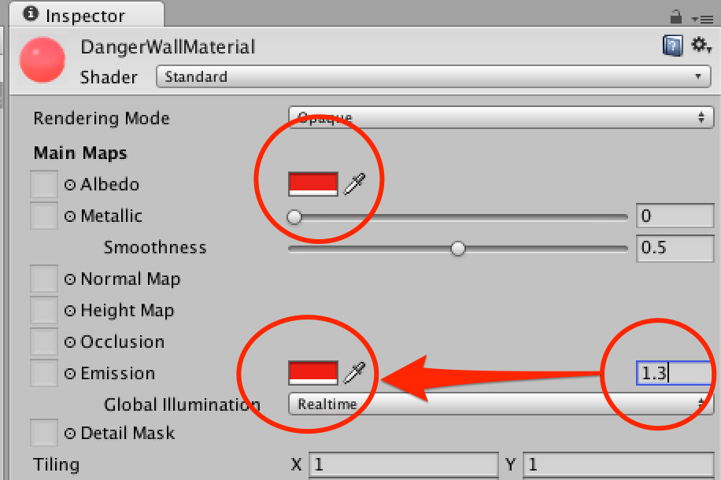
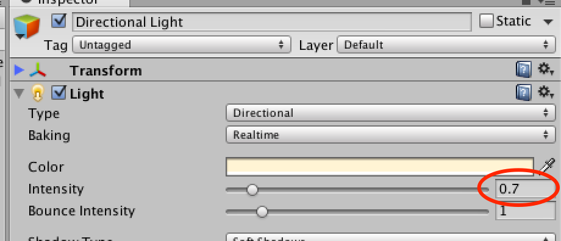

#7.障害物とリスタート

このままでは誰でも確実にゲームをクリアしてしまいます。
そこで、「ぶつかってはいけない壁にぶつかったらゲームオーバー」のルールを追加します。

要素を分解すると以下の要素を追加すれば良さそうです。

1.  「ぶつかってはいけない壁」の設定
2.  壁にぶつかった際のイベントを設定
3.  ぶつかった際にシーンを再ロードする

##ぶつかってはいけない壁の作成

まずは「ぶつかってはいけない壁」を作成します。

###Danger Wallプレハブの作成

1.  HIerachyビューのCreateをクリックします。
2.  3D Object > Cubeを選択します。
3.  作成したオブジェクト名は"Danger Wall"とします。
4.  作成したDanger WallオブジェクトはPrefabに設定します。


###DangerWallの色を設定

DangerWallは接触することの出来ない危険な壁ですので、より危険度の高く見えるよう「光る壁」として色を設定します。

1.  ProjectブラウザのCreateをクリックします。
2.  Materialを選択し、DangerWallMaterialを作成します。
3.  Inspectorビューで以下の設定を行います。  
(Albedoを「赤」に設定、　Emissionを「1.5」に設定し色を赤に設定）



1.  作成したDangerWallMaterialをHIerarchyビューのDangerWallオブジェクトへドラッグ＆ドロップします。
2.  ApplyをクリックしDangerWallプレハブを更新します。


###Danger Wallの配置

次にDanger Wallを幾つか配置します。
この部分は好きな様に配置して構いません。但しゲームがクリア出来なくなるのでItemの位置に被らないようにして下さい。

例えば、以下のように配置します。


1.  DangerWallを3つシーンに配置します。
2.  各オブジェクトを以下のように配置します。  
**DangerWall 1**  
position (x:4, y:0.5, z:3) rotation (x:0, y:0, z:0)  scale(x:10, y:1, z:1)  
**DangerWall 2**  
position (x:4, y:0.5, z:-4) rotation (x:0, y:0, z:0)  scale(x:10, y:1, z:1)  
**DangerWall 3**  
position (x:-5, y:0.5, z:4) rotation (x:0, y:90, z:0)  scale(x:10, y:1, z:1)  

###DangerWallの整理とstatic化

DangerWallがSceneに沢山配置されていますので、これをDangerWallsオブジェクトを使用して整理します。また、DangerWallは動かないオブジェクトですので、staticを使用して位置を固定します。

1.  HierarchyビューのCreateをクリックします。
2.  Create Emptyを選択し、作成したオブジェクト名を「DangerWalls」に変更します。
3.  DangerWallオブジェクト一覧をDangerWallsへドラッグ＆ドロップして親子関係を設定。　
4.  DangerWallsのstaticにチェックを入れる。


###太陽光の輝度を下げる

壁が光っていますが太陽光の輝度が高く少し分かり難いです。
ですので、太陽光の輝度を下げます。

1.  HierarchyビューのDirectionalLightを選択します。
2.  InspectorビューでLightコンポーネントのIntensityを「0.7」に設定します。



##ぶつかったら判定の設定

次に「当たったらシーンを再起動」する機能を作成します。

1.  HierarchyビューでDanger Wallを選択します。
2.  InspectorビューでAdd Componentボタンをクリックします。
3.  New Scriptを選択し、「DangerWall」コンポーネントを作成します。
4.  Applyをクリックし、全てのPrefabへ反映させます。


##スクリプトの更新

まずは「接触したか」の判定を受けるコールバックを設定します。

1.  DangerWall.csをMonodeveopで開きます。
2.  内容を以下の内容に変更します。

```
using UnityEngine;
using System.Collections;

public class DangerWall : MonoBehaviour
{
	// オブジェクトと接触した時に呼ばれるコールバック
	void OnCollisionEnter (Collision hit)
	{
		// 何かの処理
	}
}
```

###シーンの再読込

接触対象がPlayerタグを持つオブジェクトの場合、シーンを再読込します。

1.  再びDangerWall.csをMonobehaviourで開きます。
2.  コードを以下の内容に変更します。

```
using UnityEngine;
using System.Collections;

public class DangerWall : MonoBehaviour
{
	// オブジェクトと接触した時に呼ばれるコールバック
	void OnCollisionEnter (Collision hit)
	{
		// 接触したオブジェクトのタグが"Player"の場合
		if (hit.gameObject.CompareTag ("Player")) {
			// 現在のシーンを再読込する
			Application.LoadLevel(Application.loadedLevel);
		}
	}
}
```

ゲームをプレイしてみてください。
今度はDangerWallを回避するように精密な操作を要求するゲームになりました。